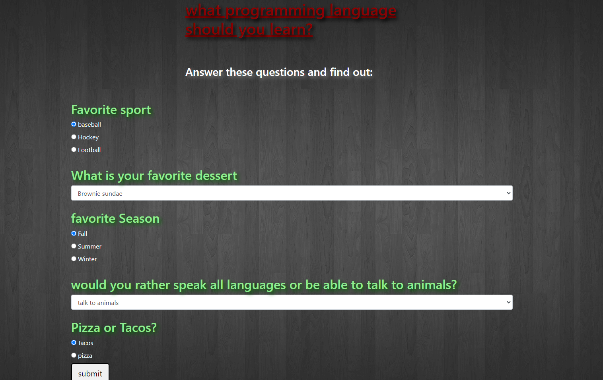

# programming-laguage-suggestor

_Author: PJ Perry_

## Summary:

this is a survey / quiz for programing languages .

## Technologies used:

- HTML
- CSS
- boostrap
- javascript
- jquery

## Description:

_this is a survey / quiz to help people decide what programing language to start with . this site demonstrates use of javascript_
## Setup/installation instructions:

### visit:https://github.com/Jamesp92/programming-language-suggestor
 * clone from repository
 * find in your local directory 
 * open in your local browser 

## Known bugs:

theres isnt answer for every input combination.

